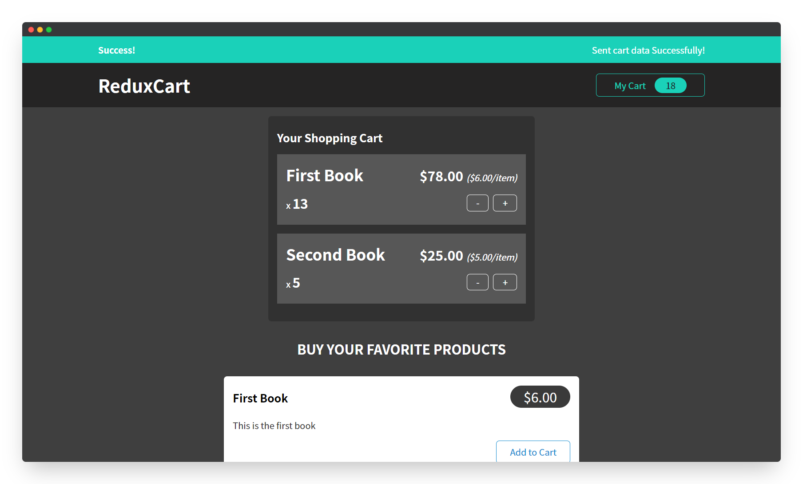
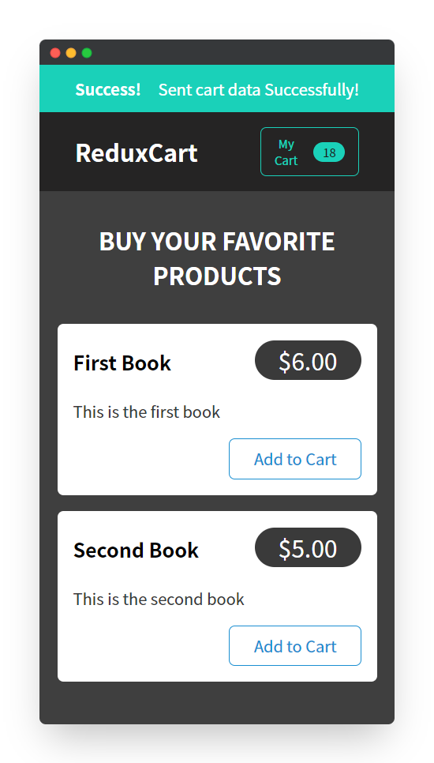

<!--
*** Thanks for checking out the react-redux-demo. If you have a suggestion
*** that would make this better, please fork the repo and create a pull request
*** or simply open an issue with the tag "enhancement".
*** Thanks again! Now go create something AMAZING! :D
***
*** To avoid retyping too much info. Do a search and replace for the following:
*** github_username (that is "windsuzu"), repo_name (that is "react-redux-demo"), project_title, project_description
-->

<!-- [![Issues][issues-shield]][issues-url] -->
<!-- [![PR Welcome][pr-welcome-shield]](#contributing) -->
[![Contributors][contributors-shield]][contributors-url]
[![MIT License][license-shield]][license-url]
[![Author][author-shield]][author-url]
[![LinkedIn][linkedin-shield]][linkedin-url]

<!-- PROJECT LOGO -->
 

  

  <h3 align="center">React Redux Demo</h3>

  

    A simple example of using redux in react, which contains <b>reactjs/toolkit</b> and <b>react-redux</b>.
     
    <a href="https://windsuzu.github.io/react-redux-demo">View Demo</a>
    ·
    <a href="https://github.com/windsuzu/react-redux-demo/issues">Report Bug</a>
    ·
    <a href="https://github.com/windsuzu/react-redux-demo/issues">Request Feature</a>
  

Table of Contents

* [About](#about)
* [Examples](#examples)
  * [✨ Synchronous Events](#-synchronous-events)
  * [💫 Asynchronous Events](#-asynchronous-events)
    * [⭐ branch-01-inside-components](#-branch-01-inside-components)
    * [⭐⭐ branch-02-action-creator-thunk](#-branch-02-action-creator-thunk)
    * [⭐⭐⭐ branch-03-createAsyncThunk](#-branch-03-createasyncthunk)
* [Preview](#preview)
* [License](#license)
* [Contact](#contact)
* [Acknowledgements](#acknowledgements)

---

<!-- ABOUT THE PROJECT -->
## About

<table>
<tr>
<td>

這個專案為 redux 的應用展示，使用兩個三方庫: `@reactjs/toolkit` 以及 `react-redux` 來開發 redux 的主要功能。 專案中分別利用 redux 實作了同步 (synchronous) 與非同步 (asynchronous) 的實際狀況。

✨ 同步狀況
* 例如: `本地的狀態改變`、`不需要網路操作 (request/response)`
* 實作內容:
  * `createSlice, configureStore` from `@reactjs/toolkit`
  * `Provider, useSelector, useDispatch` from `react-redux`

---

💫 非同步狀況
* 例如: `需要網路操作`、`載入資料庫資料 (fetch)`、`上傳資料到資料庫 (send request)`、`網路操作後更新 UI 元件`
* 實作內容:
  * 上傳
    * 利用 `useEffect` 監控本地端已更新好的資料，並上傳同步伺服器
  * 下載、更新 UI 介面 **(有三種作法)**
    1. 在 `components` 中處理獲得資料後的 dispatch 
    2. 自製 `Action Creator Thunk` 處理 dispatch
    3. 使用 @reactjs/toolkit 提供的 `createAsyncThunk`

**Built With**

* HTML5, CSS3, Javascript ES6
* React.js + Redux
* @redux.js/toolkit
* react-redux

**[DEMO]** : https://windsuzu.github.io/react-redux-demo

</td>
</tr>
</table>

---

## Examples

### ✨ Synchronous Events

> 以 UI 的 toggle shoppingCart 功能為例，開發時照著以下步驟導入 redux

1. [createSlice](https://github.com/windsuzu/react-redux-demo/blob/main/src/store/ui-slice.js#L4-L11)
2. [configureStore](https://github.com/windsuzu/react-redux-demo/blob/main/src/store/index.js#L5-L8)
3. [Provider](https://github.com/windsuzu/react-redux-demo/blob/main/src/index.js#L5-L11)
4. [[useSelector]](https://github.com/windsuzu/react-redux-demo/blob/main/src/App.js#L13) [[control JSX]](https://github.com/windsuzu/react-redux-demo/blob/main/src/App.js#L41-L44)
5. [useDispatch](https://github.com/windsuzu/react-redux-demo/blob/main/src/components/Cart/CartButton.js#L8-L12)

### 💫 Asynchronous Events

> 以 fetchCartData, sendCartData 功能為例，開發時可以選用下列三種方式導入 redux

#### ⭐ [branch-01-inside-components](https://github.com/windsuzu/react-redux-demo/tree/01-inside-components)

這個方法將所有的**網路處理邏輯**寫在 App Component 當中。把 `slice / store` 保持得很乾淨，只有簡單的 state 與 action 處理；但對網路的處理 (等待、失敗、成功) 都寫在 `App Component`，讓 `App Component` 變得很雜亂。

* **ASYNC CODE**
  * [App - fetchCartData](https://github.com/windsuzu/react-redux-demo/blob/01-inside-components/src/App.js#L19-L38)
  * [App - sendCartData](https://github.com/windsuzu/react-redux-demo/blob/01-inside-components/src/App.js#L40-L80)
* **NO ASYNC CODE**
  * [cartSlice](https://github.com/windsuzu/react-redux-demo/blob/01-inside-components/src/store/cart-slice.js)
  * [uiSlice](https://github.com/windsuzu/react-redux-demo/blob/01-inside-components/src/store/ui-slice.js)

#### ⭐⭐ [branch-02-action-creator-thunk](https://github.com/windsuzu/react-redux-demo/tree/02-action-creator-thunk)

這個方法將**網路處理邏輯**分開寫在一個額外的檔案 `cartAction` 中，並且因為 thunk 的優點，可以繼續使用 dispatch 發送更新需求給 redux。 原本的 `slice / store` 完全沒改變，而且 `App Component` 變得很乾淨。 

* **ASYNC CODE**
  * [cartAction - fetchCartData](https://github.com/windsuzu/react-redux-demo/blob/02-action-creator-thunk/src/store/cart-action.js#L4-L24)
  * [cartAction - sendCartData](https://github.com/windsuzu/react-redux-demo/blob/02-action-creator-thunk/src/store/cart-action.js#L26-L63)
* **NO ASYNC CODE**
  * [cartSlice](https://github.com/windsuzu/react-redux-demo/blob/02-action-creator-thunk/src/store/cart-slice.js) **(no change)**
  * [uiSlice](https://github.com/windsuzu/react-redux-demo/blob/02-action-creator-thunk/src/store/ui-slice.js) **(no change)**
  * [App - fetchCartData](https://github.com/windsuzu/react-redux-demo/blob/02-action-creator-thunk/src/App.js#L18-L21) **(become no asnyc code)**
  * [App - sendCartData](https://github.com/windsuzu/react-redux-demo/blob/02-action-creator-thunk/src/App.js#L23-L30) **(become no asnyc code)**

#### ⭐⭐⭐ [branch-03-createAsyncThunk](https://github.com/windsuzu/react-redux-demo/tree/03-createAsyncThunk)

這個方法是 02-action-creator-thunk 的進階方法，使用 @redux/toolkit 的 `createAsyncThunk` 讓**網路處理邏輯**和 `slice / store` 變得更清楚。 因為 `createAsyncThunk` 會自動產生每個 function 的 `pending`、`fulfilled` 和 `rejected` 三個狀況，所以我們可以在 `createSlice` 中用 `extraReducers` 去操控每個 function 三個狀況需要改變的 state。

* **ASYNC CODE**
  * [cartAction - fetchCartData](https://github.com/windsuzu/react-redux-demo/blob/03-createAsyncThunk/src/store/cart-action.js#L5-L9) (**become leaner**)
  * [cartAction - sendCartData](https://github.com/windsuzu/react-redux-demo/blob/03-createAsyncThunk/src/store/cart-action.js#L11-L17) (**become leaner**)
* **STATE CODE**
  * [cartSlice - fetchCartData [fulfilled]](https://github.com/windsuzu/react-redux-demo/blob/03-createAsyncThunk/src/store/cart-slice.js#L39-L44)
  * [uiSlice - fetchCartData [rejected]](https://github.com/windsuzu/react-redux-demo/blob/03-createAsyncThunk/src/store/ui-slice.js#L13-L19)
  * [uiSlice - sendCartData [pending, fulfilled, rejected]](https://github.com/windsuzu/react-redux-demo/blob/03-createAsyncThunk/src/store/ui-slice.js#L20-L40)
* **NO ASYNC CODE**
  * [App - fetchCartData](https://github.com/windsuzu/react-redux-demo/blob/03-createAsyncThunk/src/App.js#L18-L21) **(no change)**
  * [App - sendCartData](https://github.com/windsuzu/react-redux-demo/blob/03-createAsyncThunk/src/App.js#L23-L30) **(no change)**

## Preview

  
  

## License

Distributed under the MIT License. See [LICENSE](https://github.com/windsuzu/react-redux-demo/blob/main/LICENSE) for more information.

## Contact

Reach out to the maintainer at one of the following places:

* [GitHub discussions](https://github.com/windsuzu/react-redux-demo/discussions)
* The email which is located [in GitHub profile](https://github.com/windsuzu)

## Acknowledgements

* [Maximilian Schwarzmüller](https://www.udemy.com/user/maximilian-schwarzmuller/)

[contributors-shield]: https://img.shields.io/github/contributors/windsuzu/react-redux-demo.svg?style=for-the-badge
[contributors-url]: https://github.com/windsuzu/react-redux-demo/graphs/contributors
[issues-shield]: https://img.shields.io/github/issues/windsuzu/react-redux-demo.svg?style=for-the-badge
[issues-url]: https://github.com/windsuzu/react-redux-demo/issues
[license-shield]: https://img.shields.io/github/license/windsuzu/react-redux-demo.svg?style=for-the-badge&label=license
[license-url]: https://github.com/windsuzu/react-redux-demo/blob/main/LICENSE
[linkedin-shield]: https://img.shields.io/badge/-LinkedIn-black.svg?style=for-the-badge&logo=linkedin&colorB=555
[linkedin-url]: https://linkedin.com/in/windsuzu
[pr-welcome-shield]: https://shields.io/badge/PRs-Welcome-ff69b4?style=for-the-badge
[author-shield]: https://shields.io/badge/Made_with_%E2%9D%A4_by-windsuzu-F4A92F?style=for-the-badge
[author-url]: https://github.com/windsuzu
